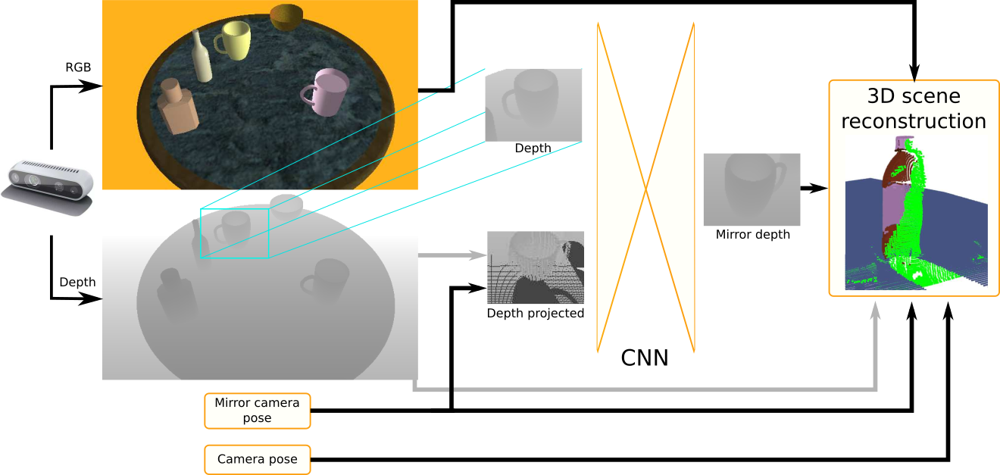
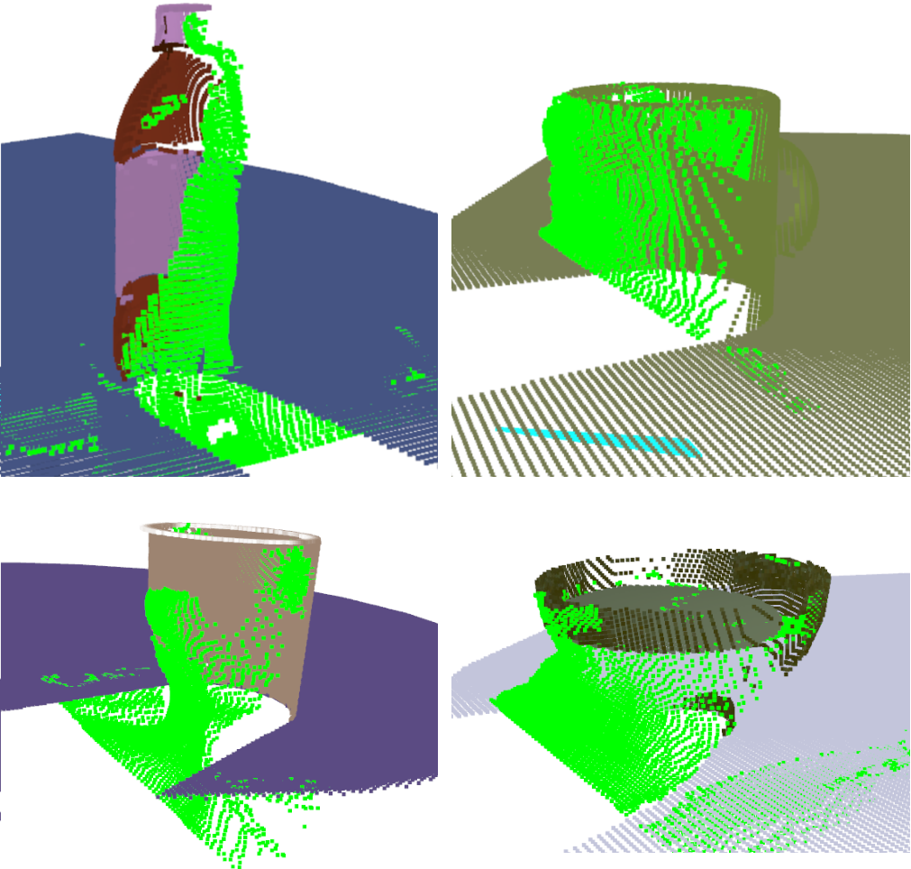

# What's on the Other Side? A Single-View 3D Scene Reconstruction

This is a [PyTorch](https://github.com/pytorch/pytorch) implementation of a single-view object reconstruction method.
The method reconstructs two-dimensional depth representation of registered objects as if there were seen from the opposite side.
The final result is a depth map which can be used to infer back-view point cloud data in order to fill in the lacking shape.

The network is fed with data representing color, depth and rear projection of depth.
All those representations are merged into one tensor which is further processed by a CNN-based neural network.





## How to train:
Each of the training scripts follows the same naming convention and can be directly run with a command:
```python *train*.py```

List of modifiable variables:
- `path: directory of a dataset`
- `save_path: directory of saved model`

## How to test:
Each of the testing scripts follows the same naming convention and can be directly run with a command:

```python *test*.py```

List of modifiable variables:
- `path: directory of a dataset`
- `save_path: directory of saved model`
- `images_save_path: directory of reconstruction results`

## Example models:
According to the conducted research the best scoring network contained color, depth and projected depth data.
- [rgbd_with_proj_model](https://drive.google.com/drive/folders/1ewI_Vz6eS9ifJqqvmLXX5yRYG2MqdQy5?usp=sharing)
